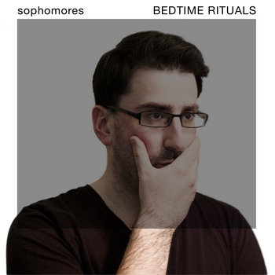

---
dirtree:
  display: False
---

#  brandon lucas green
Hey! I’m a product leader, music maker, remote work advocate, writer, husband and father. I live and work in central Massachusetts with my [wife][1], daughter and [doggo][2]. I love digging into the deeply human psychology behind the problems we face and thinking toward the right solutions. 🤘🏻

[[Blog]] | [Book time][8] | [Email me][4] | [Twitter][6] | [LinkedIn][7]

I'm currently employed by [Wayfair][12], leading the product team managing our experimentation platform, tools and culture. I also enjoy pour-over coffee, DIYing my house, [making music][10] and occasionally writing.

*Previously: [🎨 Abstract][9], [💍 CustomMade][13], [🎧 Drops][14], [📢 Sonicbids][15]*

### [tone deaf color blind &rarr;][11]
I sometimes refine and publish ideas on tech, working and self-improvement in the face of impostor syndrome as a newsletter called **tone deaf color blind.** It's been on a sort of hiatus due to the birth of my daughter, but all my previous writing is online for your enjoyment. You can read [here][11] or subscribe below: 

<form
  action="https://buttondown.email/api/emails/embed-subscribe/tonedeafcolorblind"
  method="post"
  target="popupwindow"
  onsubmit="window.open('https://buttondown.email/tonedeafcolorblind', 'popupwindow')"
  class="embeddable-buttondown-form"
>
  <label for="bd-email">Enter your email</label>
  <input type="email" name="email" id="bd-email" />
  <input type="hidden" value="1" name="embed" />
  <input type="submit" value="Subscribe" />
</form>
 

### [sophomores &rarr;][10]
I sometimes write songs and release them under the alias **Sophomores**. I've released 6 albums to date, mostly in the genres of synthpop, industrial rock and alternative rock. All of my music is available online for free on Bandcamp, [Spotify](https://open.spotify.com/artist/311HUT6dPGAfIekpDFD45o) and [Apple Music](https://music.apple.com/us/artist/sophomores/676742660).

[1]:	https://aliciagreen.co
[2]:	https://www.instagram.com/p/CDeAU24JQgU/?igshid=1fvajh00evbb9
[3]:	/impulse.html
[4]:	mailto:brandonlucasgreen@gmail.com
[5]:	https://instagram.com/brandonlucasgreen
[6]:	https://twitter.com/sphmrs
[7]:	https://linkedin.com/in/brandonlgreen
[8]:	https://tidycal.com/brandonlucasgreen/30-minute-meeting
[9]:	https://abstract.com
[10]:	https://sophomoresmusic.com
[11]:	https://buttondown.email/tonedeafcolorblind/archive
[12]:	https://wayfair.com
[13]:	https://custommade.com
[14]:	http://drops.nyc/
[15]:	https://sonicbids.com
[16]:	static/brandongreen_resume.pdf
